# FreezeG
Freezing generator for pseudo image translation

### Cat2Wild [AFHQ]
 &nbsp; 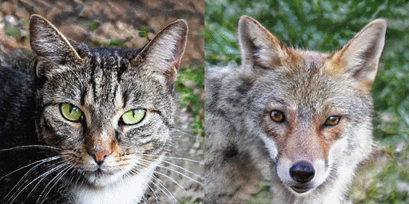 &nbsp;\
 &nbsp; 

### Face2Malnyun [FFHQ, Malnyun]
 &nbsp;  &nbsp;\
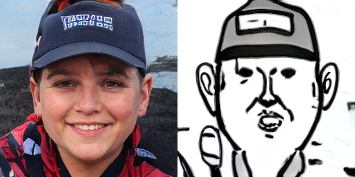 &nbsp;  &nbsp;\
 &nbsp;  &nbsp;\
 &nbsp;  &nbsp;

Interpolation

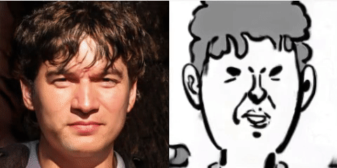 &nbsp;  &nbsp;\
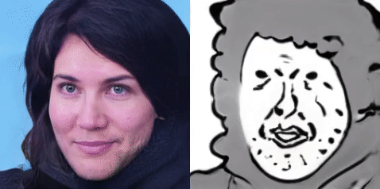 &nbsp;  &nbsp;\
 &nbsp;  &nbsp;\
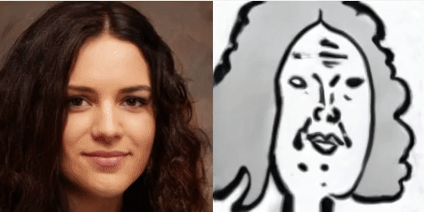 &nbsp; 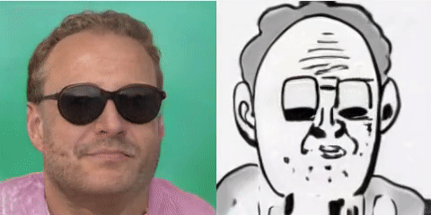 &nbsp;\
 &nbsp;  &nbsp;

Failures

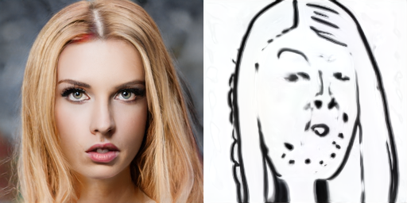 &nbsp; 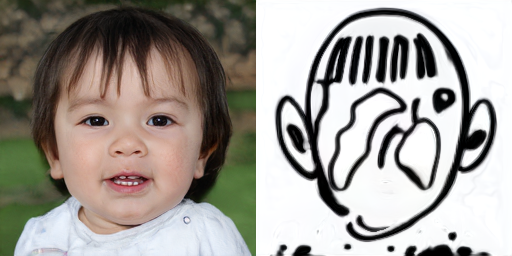 &nbsp;

### Face2Simpsons [FFHQ, Simpsons]
 &nbsp;  &nbsp;\
 &nbsp;  &nbsp;\
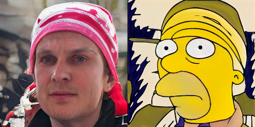 &nbsp;  &nbsp;\
 &nbsp; 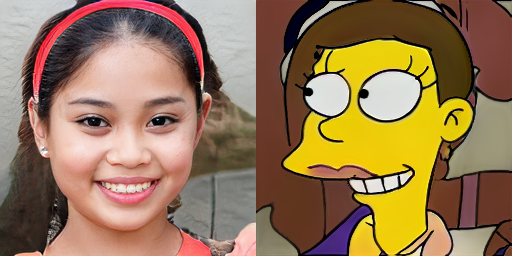 &nbsp;\
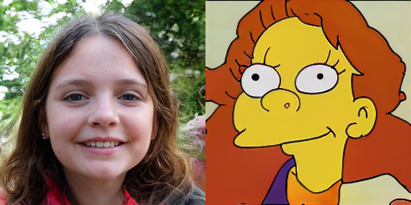 &nbsp;  &nbsp;\
 &nbsp;  &nbsp;\
 &nbsp;  &nbsp;\
 &nbsp;  &nbsp;\
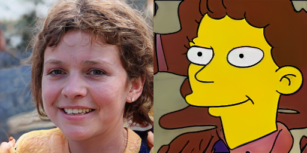 &nbsp; 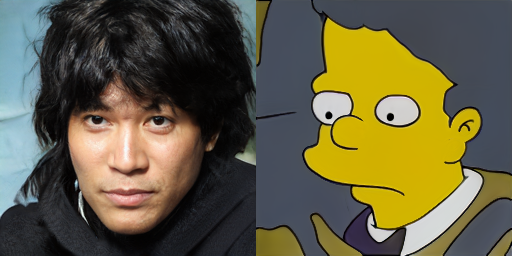 &nbsp;

Interpolation

 &nbsp;  &nbsp;\
 &nbsp;  &nbsp;

Failures

 &nbsp;  &nbsp;\
 &nbsp;  &nbsp;\
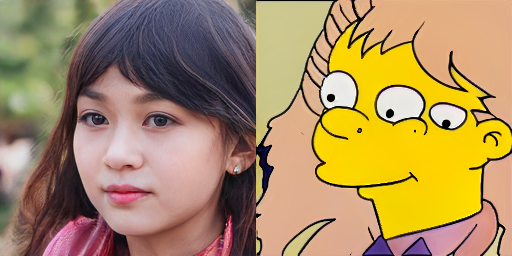 &nbsp;  &nbsp;\
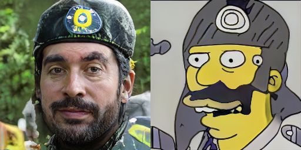 &nbsp; 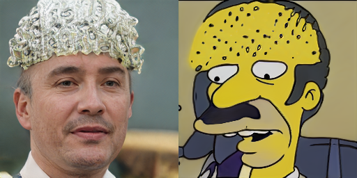 &nbsp;

### Face2Dog [FFHQ, AFHQ]
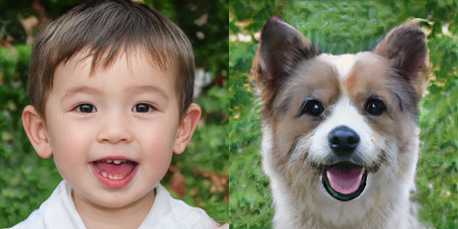 &nbsp; 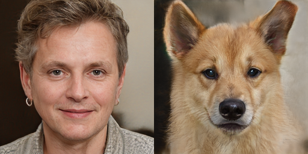 &nbsp;\
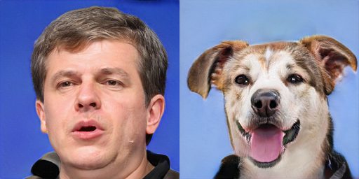 &nbsp; 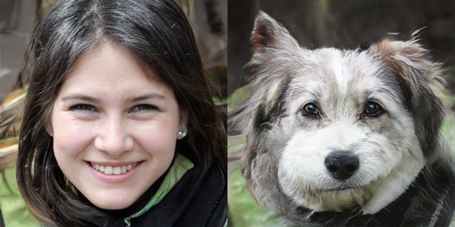 &nbsp;\
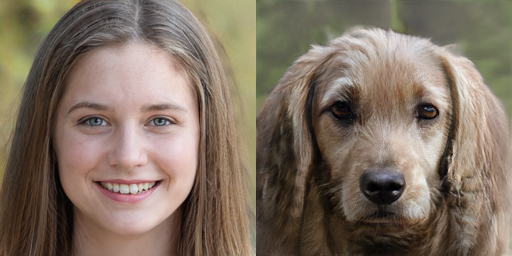 &nbsp;  &nbsp;\
 &nbsp; 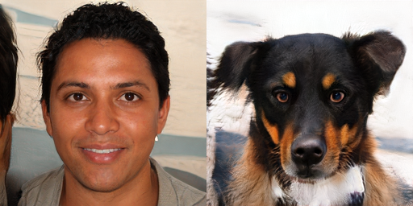 &nbsp;\
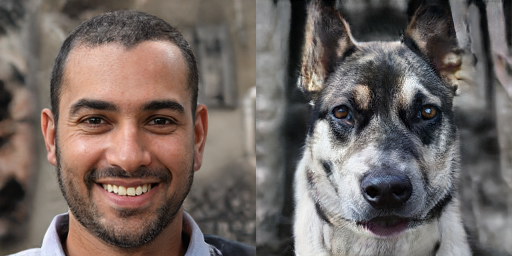 &nbsp;  &nbsp;\
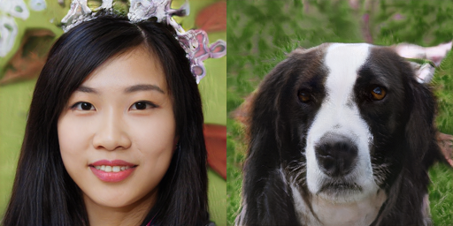 &nbsp; 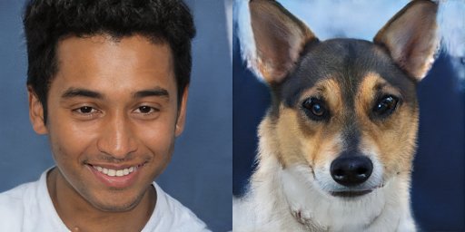 &nbsp;\
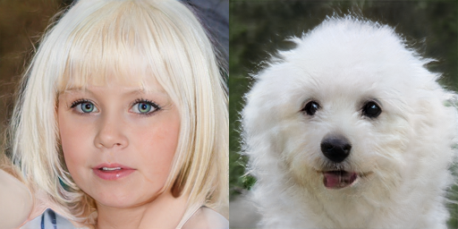 &nbsp;  &nbsp;\
 &nbsp;  &nbsp;\
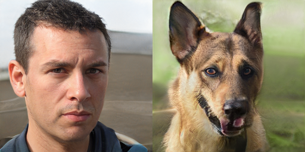 &nbsp; 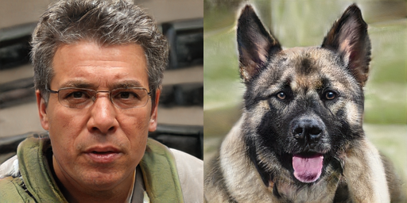 &nbsp;

Interpolation

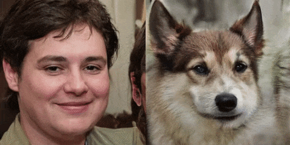 &nbsp; 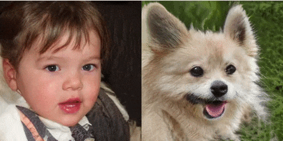 &nbsp;\
 &nbsp;  &nbsp;

Failures

 &nbsp;  &nbsp;\
 &nbsp; 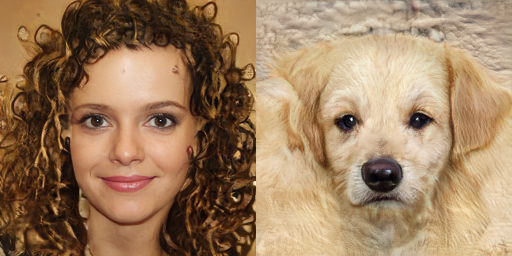 &nbsp;

### Face2Art [FFHQ, MetFaces]
 &nbsp;  &nbsp;\
 &nbsp; 

### Cat2Flower [AFHQ, OxfordFlowers]
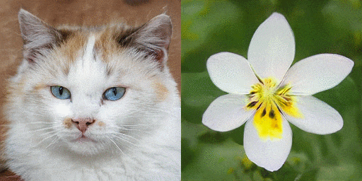 &nbsp; 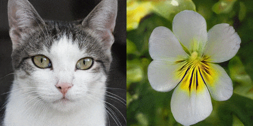 &nbsp;

